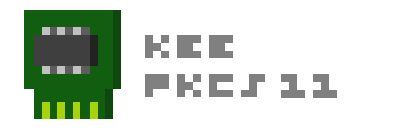

KeePKCS11 это простой плагин для оригинального [KeePass](https://keepass.info/), добавляющий ключевой поставщик, взаимодействующий с [pkcs11](https://docs.oasis-open.org/pkcs11/pkcs11-base/) библиотекой для ваших криптографический токенов.

Плагин **НЕ** реализует ассиметричное шифрование или любое другое взаимодействие с сертификатами. Вместо этого он создает/читает объекты CKO_DATA, CKA_VALUE которых KeePass испольует для симетричного шифрования.

Плагин использует C# библиотеку [Pkcs11Interop](https://github.com/Pkcs11Interop/Pkcs11Interop). Вы также можете вручную создавать, удалять, экспортировать, импортировать объекты, используя [Pkcs11Admin](https://github.com/Pkcs11Admin/Pkcs11Admin).

Свойства CKO_DATA:
 - CKA_CLASS: 		CKO_DATA
 - CKA_TOKEN: 		True
 - CKA_PRIVATE:		True 
 - CKA_MODIFIABLE:	False
 - CKA_LABEL:		**Custom label**
 - CKA_VALUE:		**Custom byte array**

⚠️ В текущей версии плагин может создавать ключевые объекты фиксированной длинны (32 символа) с энтропией ≈135.71. Для создания используется функция *Random()*, что не безопасно. Недочет будет исправлен в следующей версии.

## Сборка

Официальная [инструкция по созданию плагинов](https://keepass.info/help/v2_dev/plg_index.html) гласит:

Выполнять команду в "cmd.exe" (пути условны)
```
C:\keepass\KeePass.exe --plgx-create C:\repos\KeePKCS11\KeePKCS11
```

В конечном каталоге "KeePKCS11" должен находиться "KeePKCS11.csproj", иначе компилятор KeePass выдаст ошибку

Будет создан файл "C:\repos\KeePKCS11\KeePKCS11.plgx"

И всё... Открывать проект, достраивать зависимости к пространству имен KeePass НЕ ОБЯЗАТЕЛЬНО.
Компилировать проект средствами Visual Studio НЕ НУЖНО, каталоги ".\KeePKCS11\bin\Debug" и ".\KeePKCS11\bin\Release" должны быть пустыми!

Внимание!!! Хэш значение компилируемого плагина будет каждый раз отличаться, даже если не было никаких изменений в проекте. Это связано с особенностями компиляции. 

## Совместимость
### Платформа

На текущий момент плагин работает только в среде Windows.

Плагин написан на .Net Framework 4.8, совместимость проверялась только с KeePass 2.58. Совместимость с более ранними версиями возможна, но не гарантируется.

### PKCS#11 токены

[PASS] - плагин полностью совместим с этим устройством.

[MOST LIKELY] - производителем заявлена поддержка стандарта PKCS#11, но тестирование на совместимость не производил.

#### [Aladdin R.D. JaCarta Единый Клиент](https://www.aladdin-rd.ru/support/downloads/jacarta_client)
* JaCarta PKI [PASS]
* JaCarta-2 ГОСТ [PASS]
* JaCarta-2 PKI/ГОСТ (видит оба апплета одновременно) [PASS]
* eToken PRO (Java) [PASS]

#### [Aladdin R.D. eToken PKI Client 5.1 SP1](https://erim.ru/gde-skachat-i-kak-ustanovit-drayvery-etoken.html)
* eToken ГОСТ [MOST LIKELY]
* eToken PRO (Java) [MOST LIKELY]

#### [Aktiv Rutoken](https://www.rutoken.ru/support/download/windows/)
* Рутокен Lite [PASS]
* Рутокен ЭЦП 2.0 / 3.0 [PASS]
* Рутокен S [MOST LIKELY]

#### [ESMART PKI Client](https://token.esmart.ru/downloads)
* ESMART Token [MOST LIKELY]
* ESMART Token ГОСТ [MOST LIKELY]

#### [Safenet Authentication Client](https://knowledge.digicert.com/general-information/how-to-download-safenet-authentication-client)
* SafeNet eToken 5110 [MOST LIKELY]
* eToken PRO (Java) [MOST LIKELY]

Если интересующего вас устройства нет в списке, но у него заявлена поддержка стандарта PKCS#11 - скорее всего оно будет работать.


## Юридическое предупреждение (Legal Disclaimer)
Данный программный продукт разработан исключительно в учебных и исследовательских целях.

### Статус проекта

❌ Не является СКЗИ (средством криптографической защиты информации).

❌ Не является СЗИ (средством защиты информации).

❌ Не имеет сертификации ФСБ, ФСТЭК или иных регуляторов.

❌ Не предназначен для использования в реальных коммерческих или государственных системах.

### Ответственность
Автор не несёт ответственности за:

* Любые последствия использования данного кода.
* Нарушения законодательства, связанные с применением криптографии.
* Ущерб, вызванный некорректной работой программы.
* Используйте на свой страх и риск.

### Рекомендации
Для работы с защищёнными данными используйте только сертифицированные СКЗИ (КриптоПро, ViPNet).

В случае сомнений проконсультируйтесь с юристом перед использованием кода.